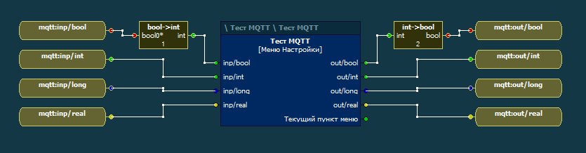
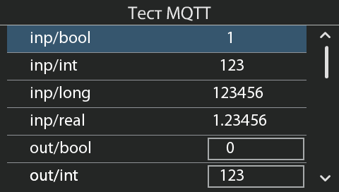

shm2mqtt
========

Утилита для обеспечения взаимодействия между контроллерами 
[SMH4](http://segnetics.com/smh4) / 
[Trim5](http://segnetics.com/trim-5)
и [MQTT](http://mqtt.org/)-брокером.

Общая информация
----------------

Поддерживается как публикация значений, так и отслеживание 
значений.

Значения отслеживаются через разделяемую память `SMLogix`, а 
конфигурация переменных считывается из файла 
`/projects/load_files.srv`.

Поддерживаются следующие типы для публицакии или 
отслеживания:

* bool;
* int;
* long;
* real.

Использование
-------------

Публикуются и отслеживаются только значения, заданные 
блоком `Mem`, имеющие префикс `mqtt:` в своем названии. 
Префикс можно задать параметром `-prefix` в командной 
строке.





Утилита `shm2mqtt` имеет следующий набор параметров 
командной строки:

```
Usage of ./shm2mqtt:
  -broker string
        The broker URI (default "tcp://127.0.0.1:1883")
  -cfg string
        Path to logix load_files.srv (default "/projects/load_files.srv")
  -fullsync int
        Full publish tick interval, s (default 60)
  -prefix string
        Variable label prefix (default "mqtt:")
  -reconnect int
        Reconnect pause, s (default 10)
  -shm string
        System V shared memory file (default "/dev/shm/wsi")
  -tick int
        Publish tick interval, ms (default 100)
```

Подключение брокера поддерживается различными протоколами 
(поддерживаемые библиотекой `paho.mqtt.golang`) и задается 
схемой URI. Примеры URI даны ниже:

* `tcp://192.168.111.1:1883`
* `ws://192.168.111.1:9001`

Сборка
------

Утилита использует MQTT-библиотеку 
[paho.mqtt.golang](https://github.com/eclipse/paho.mqtt.golang).
Перед сборкой приложения нужно выгрузить зависимости, выполнив команды:

```
go get golang.org/x/text/encoding/charmap
go get golang.org/x/net/websocket
go get golang.org/x/net/proxy
go get github.com/eclipse/paho.mqtt.golang
```

Программу можно собрать из Windows, запустив файл 
`build_linux.bat`.